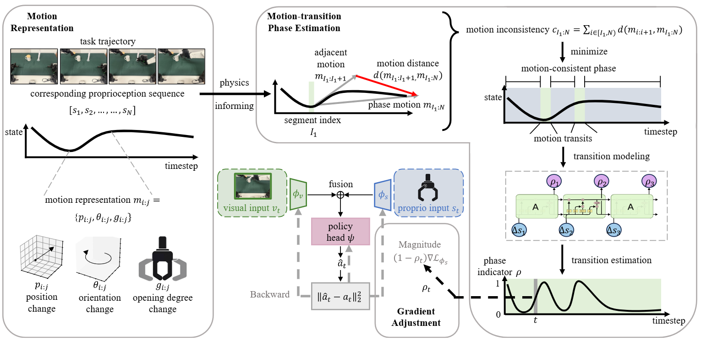

# When Would Vision-Proprioception Policies Fail in Robotic Manipulation?

Authors: [Jingxian Lu](https://github.com/JingxianLu)\*, [Wenke Xia](https://xwinks.github.io/)\*, Yuxuan Wu, [Zhiwu Lu](https://scholar.google.cz/citations?user=OUXS8doAAAAJ), [Di Hu](https://scholar.google.cz/citations?user=F7bvTOEAAAAJ)†

Accepted By: __2026 International Conference on Learning Representations (ICLR)__

Resources:[[Project Page](https://gewu-lab.github.io/Gradient_Adjustment_with_Phase-guidance/)], [[Paper](https://openreview.net/forum?id=2RIqqNqALN&noteId=NwdhXObvoO)]

If you have any questions, please open an issue or send an email to jingxianlu1122@gmail.com.
___

## Introduction

This is the PyTorch code of our paper: __When Would Vision-Proprioception Policies Fail in Robotic Manipulation?__

In this work, we investigate when vision-proprioception policies would fail in robotic manipulation by conducting temporally controlled experiments. We found that during task sub-phases that robot's motion transitions, which require target localization, the vision modality of the vision-proprioception policy plays a limited role. Further analysis reveals that the policy naturally gravitates toward concise proprioceptive signals that offer faster loss reduction when training, thereby dominating the optimization and suppressing the learning of the visual modality during motion-transition phases. 



As shown, we propose the __Gradient Adjustment with Phase-guidance (GAP)__ algorithm that adaptively modulates the optimization of proprioception, enabling dynamic collaboration within the vision-proprioception policy. Specifically, we leverage proprioception to capture robotic states and estimate the probability of each timestep in the trajectory belonging to motion-transition phases. During policy learning, we apply fine-grained adjustment that reduces the magnitude of proprioception's gradient based on estimated probabilities, leading to robust and generalizable vision-proprioception policies.

## Setup

This code has been tested on Ubuntu 18.04 with PyTorch 2.1.0+cu121.

__Create Environment__

```bash
conda env create -f environment.yml
```

__Configuration__

1. Update the corresponding paths in the `cfgs` directory.
2. Copy `costdirection.py` to the `costs` folder in the ruptures library.
3. Add the following import statement to `__init__.py` of ruptures to enable the custom cost function:

```python
from .costdirection import CostDirection
```

## Training

Train the model using the following command:

```bash
python gap/gap.py task=assembly method=gap image=true proprio=true
```

You can configure the target task and input modalities through command-line arguments. The example above trains on the `assembly` task with both image and proprioception modalities.

## Evaluation

Run inference on the trained model:

```bash
python gap/inference.py task=assembly method=gap image=true proprio=true
```